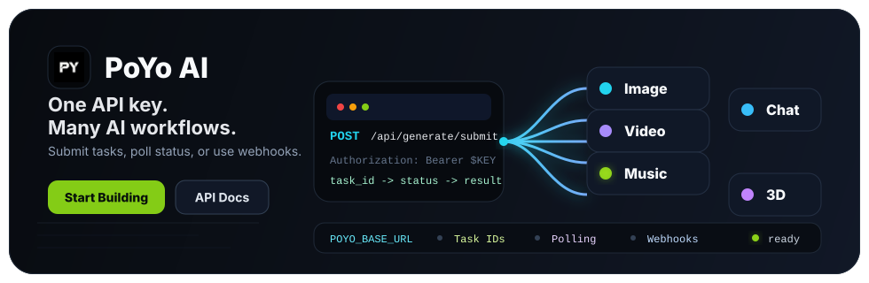

<p align="center">
  <a href="https://poyo.ai">
    
  </a>
</p>

<p align="center">
  <a href="https://poyo.ai"></a>
  <a href="https://docs.poyo.ai"></a>
  <a href="https://poyo.ai/models"></a>
  <a href="https://github.com/PoyoAPI/poyo-examples"></a>
</p>

## One API for AI model workflows

PoYo AI gives developers one production API workflow for image, video, music, chat, and 3D model generation: submit a task, store `task_id`, poll in testing, and use webhooks in production.

Start with [PoyoAPI/poyo-examples](https://github.com/PoyoAPI/poyo-examples) for the full backend-safe workflow, then use focused model repos when you already know which model you want to integrate.

## Main examples repo

Use [PoyoAPI/poyo-examples](https://github.com/PoyoAPI/poyo-examples) when you want the full backend-safe path across cURL, Node.js, Python, Next.js routes, status polling, and production webhooks.

## Recent model quickstarts

Use these when you are coming from a recent model demo and want the smallest backend-safe request first.

| Model | Start here |
| --- | --- |
| Veo 3.1 Official | [veo-3-1-official-api](https://github.com/PoyoAPI/veo-3-1-official-api) |
| Gemini 3 | [gemini-3-api](https://github.com/PoyoAPI/gemini-3-api) |
| DeepSeek V4 | [deepseek-v4-api](https://github.com/PoyoAPI/deepseek-v4-api) |
| Grok Imagine Video 1.5 | [grok-imagine-video-1-5-api](https://github.com/PoyoAPI/grok-imagine-video-1-5-api) |
| ElevenLabs v3 TTS | [elevenlabs-v3-tts-api](https://github.com/PoyoAPI/elevenlabs-v3-tts-api) |
| MiniMax Music 2.6 | [minimax-music-2-6-api](https://github.com/PoyoAPI/minimax-music-2-6-api) |
| Claude Sonnet 5 | [claude-sonnet-5 cURL](https://github.com/PoyoAPI/poyo-examples/blob/main/curl/chat/claude-sonnet-5.md) |
| Nano Banana 2 Lite | [nano-banana-2-lite cURL](https://github.com/PoyoAPI/poyo-examples/blob/main/curl/image/nano-banana-2-lite.md) |
| Omni Flash | [omni-flash cURL](https://github.com/PoyoAPI/poyo-examples/blob/main/curl/video/omni-flash.md) |
| Grok Imagine Image | [grok-imagine-image cURL](https://github.com/PoyoAPI/poyo-examples/blob/main/curl/image/grok-imagine-image.md) |
| Seedance 2.0 Mini | [seedance-2-mini cURL](https://github.com/PoyoAPI/poyo-examples/blob/main/curl/video/seedance-2-mini.md) |
| Kling 3.0 Turbo | [kling-3-0-turbo cURL](https://github.com/PoyoAPI/poyo-examples/blob/main/curl/video/kling-3-0-turbo.md) |

## Focused model repos

Use these when you already know the model you want and need a smaller repo to copy from.

| Category | Repository |
| --- | --- |
| Chat | [gemini-3-api](https://github.com/PoyoAPI/gemini-3-api), [deepseek-v4-api](https://github.com/PoyoAPI/deepseek-v4-api), [claude-sonnet-5-api](https://github.com/PoyoAPI/claude-sonnet-5-api) |
| Image | [gpt-image-2-api](https://github.com/PoyoAPI/gpt-image-2-api), [grok-imagine-image-api](https://github.com/PoyoAPI/grok-imagine-image-api), [nano-banana-2-lite-api](https://github.com/PoyoAPI/nano-banana-2-lite-api), [nano-banana-2-api](https://github.com/PoyoAPI/nano-banana-2-api), [nano-banana-pro-api](https://github.com/PoyoAPI/nano-banana-pro-api) |
| Video | [veo-3-1-official-api](https://github.com/PoyoAPI/veo-3-1-official-api), [grok-imagine-video-1-5-api](https://github.com/PoyoAPI/grok-imagine-video-1-5-api), [omni-flash-api](https://github.com/PoyoAPI/omni-flash-api), [kling-3-0-turbo-api](https://github.com/PoyoAPI/kling-3-0-turbo-api), [seedance-2-api](https://github.com/PoyoAPI/seedance-2-api), [sora-2-official-api](https://github.com/PoyoAPI/sora-2-official-api), [happy-horse-api](https://github.com/PoyoAPI/happy-horse-api) |
| Music | [elevenlabs-v3-tts-api](https://github.com/PoyoAPI/elevenlabs-v3-tts-api), [minimax-music-2-6-api](https://github.com/PoyoAPI/minimax-music-2-6-api) |

## Example model families

| Category | Families |
| --- | --- |
| Chat |    |
| Image |     |
| Video |      |
| Music |   |
| 3D |   |

## Quickstart

1. Create an account at [poyo.ai](https://poyo.ai).
2. Create an API key in the [dashboard](https://poyo.ai/dashboard/api-key).
3. Submit a generation task.
4. Save the returned `task_id`.
5. Poll status in testing.
6. Use `callback_url` webhooks in production.

```bash
export POYO_API_KEY="your-api-key"
export POYO_BASE_URL="https://api.poyo.ai"

curl -X POST "$POYO_BASE_URL/api/generate/submit" \
  -H "Authorization: Bearer $POYO_API_KEY" \
  -H "Content-Type: application/json" \
  -d '{
    "model": "gpt-image-2",
    "input": {
      "prompt": "A clean product render of a translucent AI cube on a white studio surface",
      "size": "1:1",
      "resolution": "1K",
      "quality": "low",
      "n": 1
    }
  }'
```

## Developer resources

- Website: [poyo.ai](https://poyo.ai)
- API docs: [docs.poyo.ai](https://docs.poyo.ai)
- Models: [poyo.ai/models](https://poyo.ai/models)
- API keys: [poyo.ai/dashboard/api-key](https://poyo.ai/dashboard/api-key)
- Examples: [PoyoAPI/poyo-examples](https://github.com/PoyoAPI/poyo-examples)
- Support: [support@poyo.ai](mailto:support@poyo.ai)
